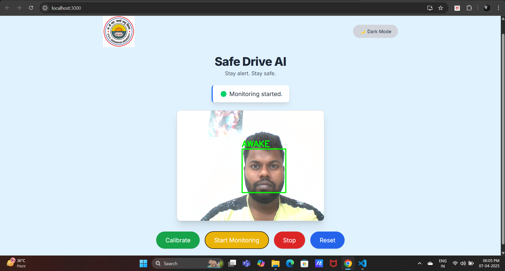

# 🌐 SafeDrive AI – Frontend

A professional and interactive drowsiness detection frontend built using **React** and **Bootstrap**. SafeDrive AI connects to a Flask-based backend that processes real-time webcam input to monitor driver alertness and trigger alarms when drowsiness is detected.

🚗 Designed with a modern UI, light/dark mode toggle, and real-time video feed for a smooth and functional experience.

🔗 [Live Demo](https://rad-centaur-e5c343.netlify.app/)

> ## 📸 Project Demonstration


---

## 🚀 Features

- 📹 Live webcam stream integration from backend
- 🎯 Control panel: Calibrate, Monitor, Stop, Reset
- 🌓 Dark Mode / Light Mode toggle
- 🔄 Countdown for calibration with real-time UI updates
- 💻 Clean and mobile-friendly responsive layout
- ⚙️ Connects to Flask backend for real-time drowsiness detection

---

## 🛠️ Tech Stack

- **React.js** – Frontend framework
- **Bootstrap** – Clean and responsive UI components
- **Tailwind CSS (optional)** – Utility-first styling for layout
- **Axios / Fetch API** – Communication with Flask backend
- **React Hooks** – `useState`, `useEffect` for state and lifecycle

---

## ⚙️ Getting Started

### 1. Clone the repo

```bash
git clone https://github.com/anshul-3000/safe_driveai.git
cd safe_driveai/frontend
```

### 2. Install dependencies
```bash
npm install
```
### 3. Run the app
```bash
npm start
```
The app will be available at: http://localhost:3000

Make sure the Flask backend is running locally at http://localhost:5000 for full functionality (including video feed and alarm).

### 🔗 Backend Repository
[👉 SafeDrive AI Backend](https://github.com/anshul-3000/safe_driveai_backend)

Note: The backend must run locally for alarm audio support.

### 🙌 Author
Anshul Chaudhary
- Machine Learning Engineer | Full-Stack Developer
- 💡 Passionate about real-time systems, AI, and safety tech

